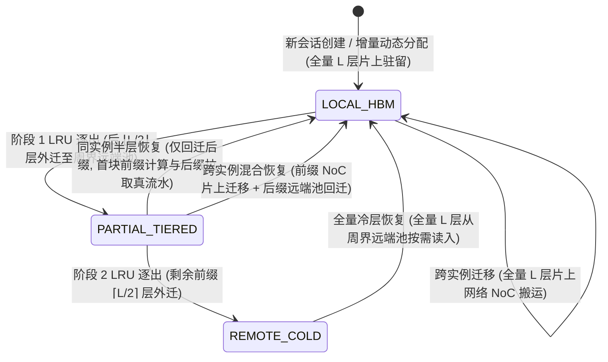
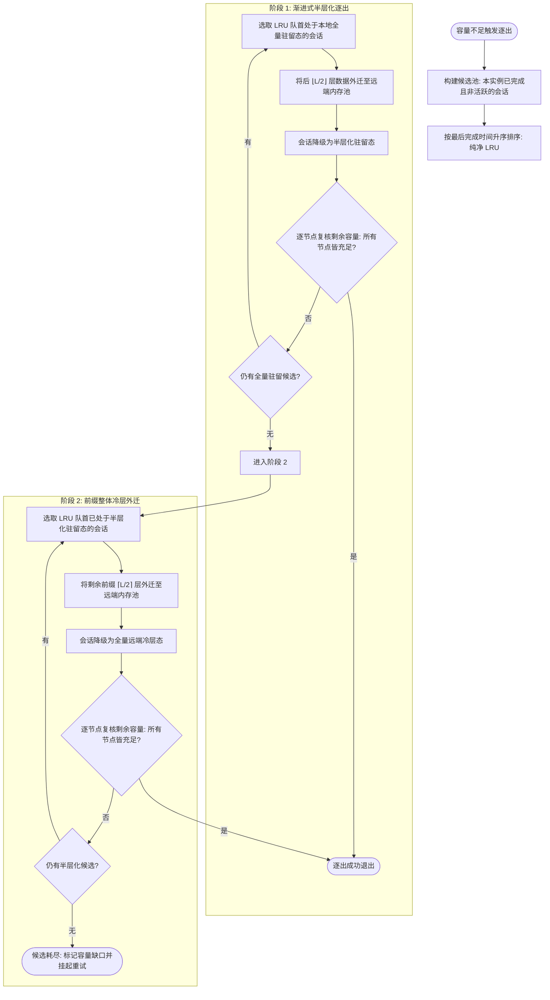
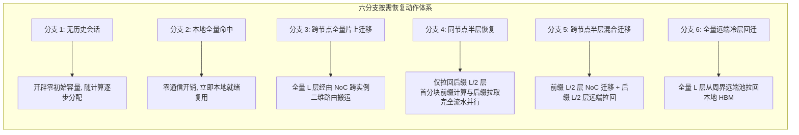
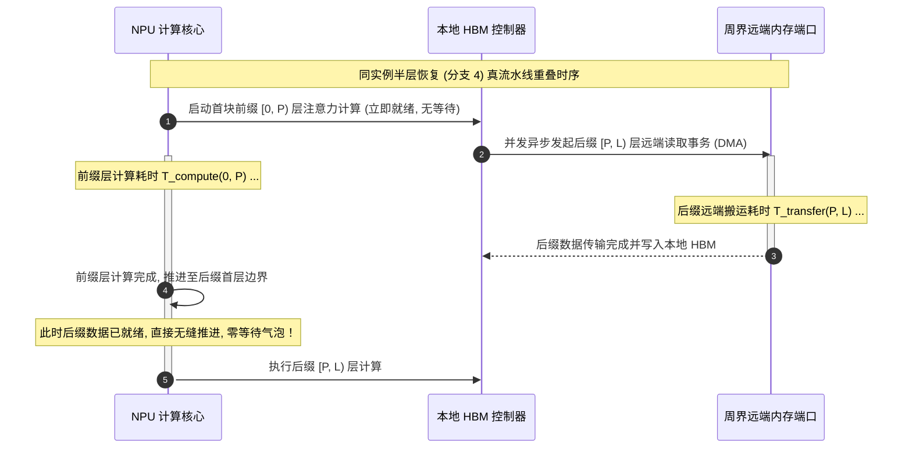
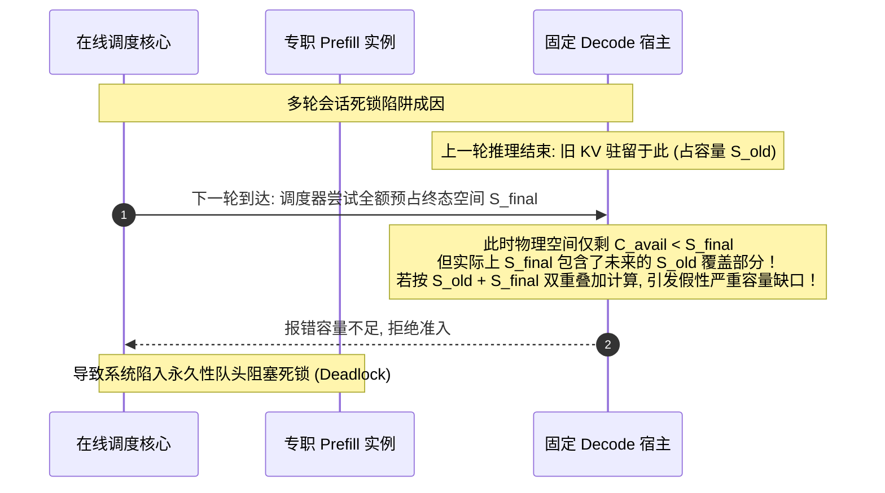
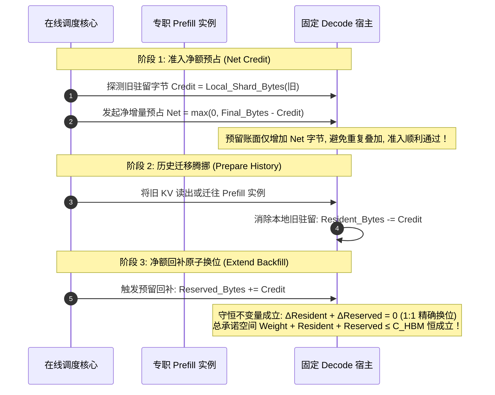

# 晶圆级大模型推理系统：Request 空间映射与 KV 缓存分层管理策略深度分析

> **体系结构总览**：本文档针对面向晶圆级（Wafer-Scale）超大规模大模型推理加速系统的两大典型基准范式——**动态全池化混合调度体系**（以 FACE 为代表）与**物理静态解耦确定性调度体系**（以 WSC-LLM 为代表），从**硬件体系结构、软件系统空间映射、分层存储组织、计算-通信流水线重叠以及物理离散事件资源争用**五个维度，展开全景式的系统级深度分析。
> 本文档摒弃特定语言代码实现与符号细节，聚焦于系统架构机制、算法策略定义、软硬件协同权衡及物理资源约束下的系统状态演化规律。

---

## 1. 体系结构与系统模型前提

### 1.1 晶圆级硬件平台抽象（Wafer-Scale Architecture）

晶圆级芯片集成数百至数千个独立处理单元（NPU），具备极高的集成度与片上互联密度。系统整体硬件模型由以下核心要素构成：

- **二维网格片上网络（2D Mesh NoC）**：
  晶圆划分为 $R \times C$ 的二维平面网格，相邻处理节点间通过双向片上互联链路连接，具备单跳网络带宽 $B_{\text{NOC}}$ 与基础单跳传输时延 $\lambda_{\text{NOC}}$。全片采用确定性维度序（XY 维度序）路由算法，提供无死锁的点对点通信能力。
- **单节点计算与本地高带宽内存（NPU & Local HBM）**：
  每个处理节点包含专用的张量计算核心与本地高带宽内存（Local HBM）。单节点具备峰值浮点算力 $F$、本地内存带宽 $B_{\text{HBM}}$、基础访存延迟 $\lambda_{\text{HBM}}$ 以及物理容量限制 $C_{\text{HBM}}$。
- **周界挂载远端内存池（Peripheral Remote Memory Pool）**：
  晶圆四周边缘周界的边界节点对外挂载高速远端内存控制器，全体边缘端口共同构成全局统一地址空间的远端冷层内存池。
  - 每个物理边缘端口在微观上表现为严格的单事务排队网关，服务带宽为 $B_{\text{rem}}$，访问基底时延为 $\lambda_{\text{rem}}$；
  - 多个独立边缘端口之间完全物理并行，逻辑容量无上限，用于暂存因片上 HBM 容量不足而外迁的冷数据；
  - 远端内存池自身不设次级淘汰，作为片上高带宽内存与外部大容量存储之间的中间缓冲层。
- **空间模型切分与实例抽象（Spatial Instance Partitioning）**：
  全片根据张量并行度（$\text{TP} = t$）划分为 $m$ 个空间互不重叠、铺满整个晶圆平面的几何连续轴对齐矩形实例（Instance）。每个实例聚合 $t$ 个处理节点，完整协同部署一个模型副本，共同承担大模型的分布式推理任务。

### 1.2 两大系统软件映射范式与演化定位

在晶圆级大模型推理系统的软件栈设计中，针对请求生命周期的两个阶段——**预填充阶段（Prefill，计算密集型）**与**解码生成阶段（Decode，访存敏感型）**，存在两种截然不同的系统软件映射范式：

1. **动态全池化混合调度范式（FACE 架构基准）**：
   - **资源组织**：取消物理硬件的角色固化，全片所有计算实例构成统一对等资源池；
   - **执行模式**：单实例在同一微步内同时执行预填充块计算与解码批处理，消除计算资源空转气泡；
   - **映射决策**：解耦的两阶段动态调度。预填充阶段在请求到达时根据全网未决计算负载实时选点；解码阶段推迟至预填充完成时刻，结合全局拓扑网络带宽与边际 Roofline 计算增量自适应绑定。
2. **物理静态解耦确定性调度范式（WSC-LLM 架构基准）**：
   - **资源组织**：将全片物理实例严格划分为专职预填充实例与专职解码实例，生命周期内角色绝不动态漂移；
   - **拓扑约束**：引入向心布局准则，将通信密集、长时驻留的解码实例置于晶圆几何中心，预填充实例呈环状环绕外围；
   - **映射决策**：离线多目标静态路由固化。离线阶段全局求解最小跳数与最小链路冲突的固定通信拓扑，在线阶段在请求到达时刻即刻钉死最终解码宿主，执行严格的先进先出（FCFS）与队头阻塞（Head-of-Line Blocking）排队。

在上述两种完全正交的请求映射范式之上，两者均引入了统一的**三态存储层次（本地、半层化、远端）**与**去类型化两阶段 LRU 逐出策略**，以“按需恢复 + 真流水线并行”彻底颠覆传统的“容量不足直接删除并重算”模式，实现了晶圆级系统由“计算换空间”向“带宽换空间”的范式转移。

---

## 2. Request 实例映射与作业调度策略

```mermaid
flowchart TD
    subgraph Paradigm_FACE[动态全池化混合调度体系]
        Req1[新请求到达] --> P_Snap[快照全体实例未决分块负荷]
        P_Snap --> P_Eval[计算负荷排序: 剩余块数 > 空闲时长 > 实例序号]
        P_Eval --> P_Probe{容量可行性预检}
        P_Probe -- 可行/改选最优 --> P_Assign[分配至目标实例队列]
        P_Probe -- 全局不可行 --> P_Block[保持原选, 挂起等待释放]
        
        P_Assign --> MixedExec[混合迭代执行: Prefill分块 + 多会话Decode推进]
        MixedExec --> P_Done[Prefill 完成边界]
        
        P_Done --> D_Filter[阶段1: 互联/访存带宽比拓扑邻域过滤]
        D_Filter --> D_Cost[阶段2: 边际 Roofline 迭代时延增量评估]
        D_Cost --> D_Tie{阶段3: 边际代价平局?}
        D_Tie -- 是 --> D_Rotate[对称性计数器循环轮转]
        D_Tie -- 否 --> D_Min[选取代价最小候选]
        D_Rotate --> D_Probe{阶段4: 目标容量可行性预检}
        D_Min --> D_Probe
        D_Probe --> D_Bind[绑定 Decode 实例并尝试准入]
    end

    subgraph Paradigm_WSCLLM[物理静态解耦确定性调度体系]
        Init[系统初始化] --> CentricLayout[向心拓扑布局: Decode 居中, Prefill 环绕]
        CentricLayout --> RouteSolve[离线多目标路由规划: 极小化总跳数与链路重叠]
        RouteSolve --> StaticMap[固化每个 Prefill 对应的唯一 Decode 宿主]
        
        Req2[新请求到达] --> Q_Len[选取排队请求数最少的 Prefill 实例]
        Q_Len --> LockDest[到达即刻永久锁定目标 Decode 宿主]
        LockDest --> FIFO_P[进入 Prefill 严格 FCFS 队列]
        FIFO_P --> Check_Fit{队首容量与准入检查}
        Check_Fit -- 空间充足 --> Exec_P[执行 Prefill 阶段]
        Check_Fit -- 资源受限 --> HOL[严格队头阻塞: 队列停滞, 绝不换路重投]
        Exec_P --> P_Finish[Prefill 计算完成]
        P_Finish --> NoC_Push[沿静态规划路由将全量 KV 迁移至固定 Decode 实例]
        NoC_Push --> Exec_D[Decode 实例执行连续批处理生成]
    end
```

### 2.1 动态全池化自适应映射机制

动态全池化调度打破了传统集群将节点固定为特定角色的僵化限制，其实例兼具处理预填充与解码生成的双重能力，通过解耦的两阶段调度捕捉全局动态运行时最优解。

#### 2.1.1 Prefill 阶段在线选点：未决计算量均衡与容量预检

- **细粒度计算负载优先准则**：
  当新请求到达系统边界时，调度器对全片所有计算实例的预填充就绪状态进行快照，按照三级字典序确定承接实例：
  1. **未决计算分块数优先**：不同长短的请求所需的预填充算力差异巨大。相比单纯统计“排队请求个数”，系统以待处理的“细粒度计算分块（Chunk）总数”作为主权值，使算力负载在各个实例间达成实质上的均衡；
  2. **空闲时长优先**：若多个实例的未决计算分块数完全一致，则优先选择距离上一次分配新任务时间最久（最空闲）的实例，最大化系统并发度并平抑突发到达毛刺；
  3. **拓扑序号确定性仲裁**：在上述条件完全相同的情况下，按实例物理编号升序破平，确保调度决策具备严格的确定性与可复现性。
- **非侵入式容量可行性预检门**：
  在确定初步目标实例后，调度器并不立即执行状态变更，而是执行只读容量试探：
  - 依据模型结构与请求全上下文计算在单节点上的物理分片需求；
  - 对候选实例进行只读探测。若主选实例当前剩余物理空间足以容纳该请求，直接原样确认（零扰动准则）；
  - 若主选实例容量不足，但在全体实例快照中存在其他能够满足容量要求的可行实例，则在可行集合内按照相同的计算负载排序规则重新选出最优实例，实现动态避障；
  - 若全网所有实例均无法容纳该请求，则依然保持原主选实例不变，请求进入排队并挂起等待后续容量释放事件，避免死循环重选。

#### 2.1.2 Decode 阶段解耦动态选点

该机制的核心创新在于将解码实例的绑定决策从“请求到达边界”推迟至“预填充完成边界”。在预填充完成的瞬间，系统根据瞬时真实的全局网络与负载拓扑独立完成二次选点。

- **阶段 1：拓扑邻域与带宽比约束（Neighborhood Filtering）**：
  系统在抽象加权实例图上，严格将候选解码实例限制在与预填充实例物理距离受限的局部几何邻域内：
  $$\text{Distance}(\text{Prefill\_Instance},\; \text{Candidate\_Instance}) \le D_{\text{limit}} = \frac{B_{\text{NOC}}}{B_{\text{HBM}}}$$
  *体系结构动因*：当跨实例通过片上网络迁移 KV 缓存的时间开销超过在本地重新访存的时间开销时，跨节点调度将彻底丧失性能收益。$D_{\text{limit}}$ 将片上网络链路带宽与本地内存带宽的物理比率直接映射为拓扑几何跳数的理论硬边界。
- **阶段 2：边际 Roofline 迭代时延增量评估（Incremental Cost）**：
  针对邻域内的每个合法候选实例，利用算力-访存 Roofline 分析模型，评估将该请求并入该实例当前活跃批处理之后，所引起的单次迭代全局时间增量：
  $$\Delta = T_{\text{iteration}}(\text{Batch} \cup \{\text{Request}\}) - T_{\text{iteration}}(\text{Batch})$$
  该指标精准反映了由于批大小增加而导致的访存受限（Memory-Bound）或算力受限（Compute-Bound）状态转移。随后将该增量按实例包含的节点规模进行归一化，得到单位节点的边际时延代价。
- **阶段 3：对称性平局循环轮转仲裁**：
  当多个候选实例的边际时延时代价值完全相等时，若固定选取首个候选，将导致请求单向堆积在局部特定节点上。系统在此处引入确定性轮转计数器，在处于平局的候选子集中采用取模循环轮转的方式分配，保证相同负载节点的均匀分摊。
- **阶段 4：只读容量可行性过滤**：
  同样在最终绑定前试探候选实例对该会话终态解码上下文的容纳能力。优先保证在不超出本地容量的前提下选择边际时延最小的节点；全域受限时同样保持代价最优者进入排队阻塞。

#### 2.1.3 混合迭代执行模型（Mixed Iteration）

在执行层，实例不预先划分专职计算流水线，而是采用“列车拼批（Train）”模型：
- 单次步进迭代由“当前队列首部请求的单个预填充计算块”与“该实例当前全部活跃会话推进单个生成的解码步”组合而成；
- 预填充计算完成后立即解除关联，移交至解码准入流程；解码会话完成生成后立即退出批处理，释放计算与并发槽位。

---

### 2.2 物理静态解耦与离线固化映射机制

与动态全池化机制形成鲜明对比，物理静态解耦机制将大模型推理的两大阶段在物理空间上彻底隔离，追求极简的在线控制开销与极高的确定性。

#### 2.2.1 物理角色静态分离与向心拓扑布局约束

- **专职硬件分区**：全片 $m$ 个计算实例被静态切分为 $n_P$ 个专职预填充实例与 $n_D$ 个专职解码实例。在系统运行生命周期内，节点角色恒定不变，预填充实例仅部署长上下文并行计算，解码实例专注于高频次访存密集型生成。
- **向心几何布局约束（Centripetal Layout Constraint）**：
  系统在空间规划上强制执行向心拓扑约束：所有解码实例的几何中心到晶圆物理中心的曼哈顿距离最大值，不得超过任何预填充实例到晶圆物理中心距离的最小值：
  $$\max_{d \in \text{Decode}} \text{Dist}(d, \text{Wafer\_Center}) \le \min_{p \in \text{Prefill}} \text{Dist}(p, \text{Wafer\_Center})$$
  *体系结构动因*：解码阶段是长时运行、受限于访存与通信的会话聚合点，其相互之间及汇聚通信最为频繁。将其布局在晶圆核心区域，能够充分利用晶圆中心最高密度的双向对分带宽；同时将预填充实例置于外围环绕，可保证外围向核心交接数据时的平均物理跳数最短。

#### 2.2.2 离线多目标静态路由固化

系统在仿真启动前，在离线阶段对全晶圆拓扑执行确定性空间组合搜索，为每一个预填充实例绑定**唯一确定的宿主解码实例**。
- **三级优化目标函数**：
  1. **全网传输总物理跳数最小化**：使全片所有预填充节点至对应解码节点的几何最短路径跳数之和绝对最小；
  2. **共享物理链路冲突数最小化**：极小化多条端到端通信路径在网格实例边界上的物理边复用重叠，最大程度杜绝多通道并发迁移引发的网络拥塞；
  3. **静态拓扑签名确定性破平**：在最优候选集中按照预定义的拓扑序签名确定唯一解，确保实验跨次运行的绝对一致。

#### 2.2.3 在线队列分配与严格队头阻塞（Head-of-Line Blocking）

- **到达时刻即刻固化绑定**：
  新请求到达系统时，调度器仅依据各预填充实例当前挂起的**排队请求总数**选择负载最小者；同时，**立即根据离线规划表直接固化其最终解码实例**。在预填充开始前，该请求未来的解码执行节点就已被永久锁定，在整个生命周期内绝不发生动态重新映射（No Remap）。
- **严格先进先出与队头阻塞（HOL Blocking）**：
  预填充队列遵循严格的先进先出（FCFS）时序。若队首请求因目标解码实例物理容量不足或本地资源紧张而无法准入，**整条队列完全停滞**。即使排在后面的请求所需显存极小，也绝对不允许超车插队；队列仅在容量释放事件驱动下重新尝试准入，绝不改投其他空闲实例，以牺牲局部吞吐为代价换取绝对的时序一致性与公平性。

---

### 2.3 两种请求映射范式的体系结构特性全景对比

| 体系结构对比维度 | 动态全池化自适应范式（FACE 架构） | 物理静态解耦确定性范式（WSC-LLM 架构） | 体系结构与软件系统映射深层意图 |
| :--- | :--- | :--- | :--- |
| **物理硬件角色划分** | 统一对等池化，所有实例动态运行混合迭代 | 硬件角色完全物理隔离（专职 Prefill + 专职 Decode） | 动态全池化消除角色间算力气泡；静态解耦消除算力-访存混合干扰 |
| **空间拓扑几何约束** | 任意铺满网格，无向心要求 | 强制向心布局（Decode 核心化，Prefill 外围化） | 静态解耦针对性优化大容量跨节点数据流向，缓解对分带宽压力 |
| **Prefill 选点优化目标** | 待处理未决计算分块总数（细粒度计算负载） | 排队请求事务个数（事务级粗粒度计数） | 动态池化感知异构长短请求的计算差异；静态解耦追求零控制开销 |
| **Decode 决策时机** | **预填充完成边界（动态在线评估）** | **请求到达边界（离线规划静态固化）** | 动态池化获取最新系统状态自适应避障；静态解耦消除运行时跨节点协调 |
| **Decode 候选空间** | 网络/访存带宽比拓扑几何邻域（$D_{\text{limit}}$） | 单一静态绑定的唯一确定实例 | 动态池化受物理互联能耗比约束；静态解耦受离线全局最优拓扑约束 |
| **Decode 负载感知模型** | **Roofline 边际迭代执行时延增量（$\Delta$）** | **完全盲视（无在线感知）** | 动态池化动态权衡批大小与上下文长度；静态解耦完全信赖静态均衡 |
| **对等代价仲裁算法** | 对称性计数器循环轮转（Round-Robin） | 静态拓扑序签名确定性破平 | 动态池化防止局部热点极化；静态解耦保证绝对时序确定性 |
| **容量受限响应策略** | 只读容量可行性过滤，支持可行集合内改选 | 严格先进先出队头阻塞（HOL Blocking），严禁改选超车 | 动态池化追求吞吐最大化；静态解耦维护全局时序公平与无饥饿 |
| **历史缓存物理位置感知** | **完全解耦（零感知）** | **完全解耦（零感知）** | 两种架构的映射层均**不以 KV 物理位置作为调度目标**，保持高度正交性 |

---

## 3. 分层式 KV 缓存管理与冷热迁移策略

在长会话与多轮对话场景下，KV 缓存的爆炸式增长是晶圆级大模型推理的主要内存瓶颈。两类架构均摒弃了传统的“容量不足直接删除并全量重算”机制，全面构建**三态分层存储（本地、半层化、远端）+ 去类型化两阶段 LRU 逐出 + 六分支按需恢复**的体系。

### 3.1 三态冷热分层模型与层区间守恒性

#### 3.1.1 存储状态定义
1. **全量本地驻留态（Full Local HBM）**：
   模型全部 $L$ 层的 KV 缓存均完整保存在本地实例各节点的 Local HBM 中，本地驻留层数即为 $L$；
2. **部分驻留半层化态（Partial Tiered）**：
   模型前缀层保留在本地 HBM，后缀层剥离并外迁至晶圆周界的远端内存池。
   - 驻留前缀层数公式：
     $$P = L - \lfloor L / 2 \rfloor = \lceil L / 2 \rceil$$
   - 外迁后缀层数：$\lfloor L / 2 \rfloor$ 层（奇数层时优先在本地保留较大半，不可拆分）；
3. **全量远端冷层态（Full Remote Memory）**：
   会话的全部 $L$ 层数据均处于周界远端内存池中，片上 HBM 驻留层数为 0，会话解除本地实例的空间归属关系。

#### 3.1.2 张量并行分片与逐节点字节严格守恒
在张量并行度为 $t$ 的切分下，多头注意力的头数在并行处理节点间按照整头进行离散分配。
- 当总头数不能被 $t$ 整除时，前序节点分得的头数较后序节点多一个，各节点实际承担的物理分片容量并不绝对对称；
- 因此，系统内**所有的容量核验必须逐处理节点（逐 Rank）独立计算**，严格杜绝采用实例均值估算；
- 针对任意会话的层区间切分，系统在数学上满足绝对的逐字节守恒恒等式：
  $$\text{Local\_Shard\_Bytes}(0, P) + \text{Remote\_Shard\_Bytes}(P, L) = \text{Total\_Shard\_Bytes}(0, L)$$

---

### 3.2 去类型化两阶段 LRU 逐出机制

当某实例任一处理节点的物理剩余容量无法容纳新请求所需的分片向量时，系统主动触发两阶段分层逐出流程。

#### 3.2.1 候选池构建与纯净 LRU 优先级裁决
- **准入准则**：仅本实例内“已完成上一轮推理且当前处于非活跃状态”的会话具备被逐出资格；当前正在执行推理的会话以及触发本次准入的新会话享有绝对保护，不可被选为受害者；
- **纯净 LRU 排序键**：严格按照会话的“最后完成时间戳”升序排序，最久未被访问的会话最优先逐出；相同时刻平局依会话全局标识符确定性破平；
- **去类型化准则**：系统坚决剔除任何业务类型（如区分人类交互或工具调用）的优先级偏见，所有会话在存储层级淘汰面前享有绝对平等的调度地位。

#### 3.2.2 渐进式两阶段逐出流程与收敛性
1. **阶段 1：后半层外迁（半层化降级）**：
   遍历本实例所有处于全量本地驻留的候选会话，依次将后 $\lfloor L/2 \rfloor$ 层数据推入远端内存池，会话状态转为半层化。
   - **单步验满即停**：每完成单个会话的半层化外迁，系统立即逐节点复查容量。只要全部节点的物理剩余空间均达到准入阈值，**立即终止淘汰循环并退出**，最大程度保留本地热数据；
2. **阶段 2：前缀整体外迁（冷层降级，唯一回退）**：
   若阶段 1 将实例内所有可半层化的会话全部外迁后容量依然不足，系统才激活阶段 2。重新按 LRU 顺序遍历已处于半层化的会话，将其剩余的前缀 $[0, P)$ 整体搬运至远端内存池，会话转为全量冷层态。同样实行逐步复核、达标即止。

#### 3.2.3 最小逐出保证与安全不变量
- **受害者资格复核不变量**：逐出操作执行完毕后，系统对全体被降级会话进行一致性复核，强制断言其在整个过程中未发生状态漂移；
- **过度逐出回滚检验不变量**：系统在算法上保证逐出量的极小化边界。在逻辑上模拟撤销最后一笔逐出操作：若撤销后释放的物理空间被收回，而受影响的处理节点仍能满足容量准入，则证明最后一笔逐出属于“过度逐出”，系统将直接触发一致性告警；
- **物理极限单请求拦截**：若单请求自身的最小分片需求直接超过了处理节点的物理可用上限（$C_{\text{HBM}} - \text{Weight}$），即便清空全实例也绝无可能容纳，系统将快速失败并终止无效重试。

---

### 3.3 六分支按需恢复与计算-通信流水线重叠

在请求完成实例映射并绑定目标实例后，系统根据历史 KV 的分布位置与状态，将恢复行为严密收敛为六大逻辑分支：

#### 3.3.1 六分支详细动作定义
1. **新会话分支**：无历史上下文，在目标实例上为该会话初始化分配基准空间，随生成动态增长；
2. **同实例本地全量命中分支**：历史数据完好驻留在目标实例的 Local HBM 中，无需发生任何片上网络或远端通信，实现零开销就地复用；
3. **跨实例全量片上迁移分支**：历史数据完整驻留在源实例的 Local HBM 中。全量 $L$ 层数据通过片上网络（NoC）采用确定性 XY 路由点对点传输至目标实例（张量并行维度各节点 $1:1$ 镜像配对）；
4. **同实例半层恢复分支（真流水线重叠）**：
   本地已具备前缀 $[0, P)$ 层，仅需从周界远端内存池拉回后缀 $[P, L)$ 层数据；
5. **跨实例半层混合迁移分支**：
   历史数据的前缀保存在源实例，后缀在远端池。第一阶段通过片上网络将前缀层从源实例传输至目标实例；第二阶段并发由远端池将后缀层恢复至目标实例；
6. **全量远端冷层回迁分支**：
   全部 $L$ 层数据由目标实例各节点经由物理曼哈顿距离最近的周界边缘端口并行读回并写入本地 HBM。

#### 3.3.2 半层化形态下的真流水线并行重叠（True Pipeline Overlap）

在**分支 4（同实例半层恢复）**中，系统利用计算与通信的解耦性，实现了近乎无损的延迟隐藏：
- 预填充阶段的首个计算分块（Chunk）在逻辑上被划分为**前缀层计算段**与**后缀层计算段**；
- 本地节点已经持有完整的前缀层 KV 数据，因此前缀层的自注意力与前馈计算**无需等待任何网络通信，立即在计算核心上全速启动**；
- 与此同时，本地内存控制器异步向周界远端内存池发起后缀层拉取传输（DMA）；
- 硬件体系结构保证：当且仅当首分块计算推进至后缀分界层时，才挂接远端后缀就绪事件门禁。由于前缀计算具备可观的时长，后缀拉取通信的大部分甚至全部时延被完全隐藏在必要的计算耗时内部，消除了计算气泡。

#### 3.3.3 “以带宽换空间”对历史重算机制的彻底消除
在传统非分层架构中，缓存受限时采用粗暴剔除，多轮交互必须在预填充时重算全部历史上下文（产生线性膨胀的重算分块数）。三态分层架构通过引入高并发周界远端池与真流水恢复，在整个系统状态机中彻底剔除了历史重算（Recompute），使预填充阶段的待计算分块严格仅包含当前轮新输入的 Token 增量，大幅削减算力浪费。

---

### 3.4 静态解耦体系下的死锁规避：准入净额预占与原子回补

在物理静态解耦体系（WSC-LLM）中，由于预填充与解码角色物理分离且路由离线固化，多轮对话将遭遇独特的容量死锁挑战。

#### 3.4.1 问题本质：静态固定路由下的“旧+新”双计死锁陷阱

1. 在静态规划体系中，Prefill 实例与 Decode 实例形成固定配对。会话在上一轮对话结束后，生成的全部旧 KV 缓存依然物理驻留在该 Decode 实例上；
2. 当下一轮对话到达时，请求被分发至对应的 Prefill 实例。调度器在准入阶段，必须提前在固定的 Decode 实例上为该请求锁定终态所需的预留配额（Reservation），以防止解码阶段因空间不足崩溃；
3. 若此时简单地按该请求的终态全量空间发起预留，由于旧数据尚未迁出，系统在账面上会将“尚未消除的旧驻留”与“终态全量预留”**重复计算叠加**；
4. 这种重复计算人为制造了巨大的虚假容量缺口，使得固定 Decode 节点无法通过准入核验，导致队列陷入不可恢复的永久性队头阻塞死锁。

#### 3.4.2 解决方案：净额折算预占与原子换位回补（Net Credit & Extend Backfill）

系统通过引入信用额度与动态原子换位，优雅化解了上述双计死锁：

1. **净额折算预占（Net Credit Calculation）**：
   在准入阶段，若全量预占触发容量短缺，调度器首先核查该会话的旧数据是否确实驻留在目标 Decode 实例上。若存在，系统将该旧数据的片上实际物理大小记为“信用额度”（Credit），仅向 Decode 实例申请净增量预占配额：
   $$\text{Credit} = \text{Local\_Shard\_Bytes}_{\text{resident}}$$
   $$\text{Net\_Reservation} = \max(0,\; \text{Final\_Shard\_Bytes} - \text{Credit})$$
   对于半层化状态，信用额度仅计入其在本地片上真实占用的前缀大小，远端部分绝不计入；
2. **腾迁与原子换位回补（Atomic Extend Backfill）**：
   请求在 Prefill 实例推进历史准备阶段，旧数据从 Decode 实例被读出或转移。一旦旧数据在 Decode 实例上的物理占用被消除，调度器立即发起账面回补：
   $$\text{Reserved\_Bytes} \mathrel{+}= \text{Credit}$$
   将先前的净额预留无缝补足为终态全额预留；
3. **闭环容量不变量保证**：
   旧驻留的消除与预留配额的回补在时间线上呈现严格的 $1:1$ 原子换位：$\Delta \text{Resident} + \Delta \text{Reserved} = 0$。在整个请求生命周期的任意微秒内，Decode 实例的总承诺空间：
   $$\text{Weight\_Bytes} + \text{Resident\_Bytes} + \text{Reserved\_Bytes} \le C_{\text{HBM}}$$
   在数学上绝对恒成立。该机制既彻底根除了多轮对话下的双计死锁，又绝对防止了该保留空间在执行期间被其他并发请求意外侵占。

---

## 4. 硬件级离散事件物理仿真与资源争用模型

调度器与缓存管理器输出的高级决策，最终映射为离散事件仿真引擎底层的物理节点与硬件资源竞争。

### 4.1 多类并发作业的 N-way 流体动态带宽均分模型

本地 HBM 作为晶圆上最关键的物理瓶颈，由底层流体带宽仲裁模型进行动态管理：

- **六类并发访存作业分类**：
  物理引擎将对单节点 Local HBM 的全部访问行为严密归类为六种形态：
  1. **计算读写作业（COMPUTE）**：模型推理核心算子执行时对权重矩阵与输入输出张量的访存；
  2. **恢复写入作业（RESTORE）**：远端内存池冷层数据回迁恢复至本地 HBM 的 DMA 写入；
  3. **片上网络读出作业（COMM_READ）**：片上网络点对点发送端从本地 HBM 提取待迁移数据；
  4. **片上网络写入作业（COMM_WRITE）**：片上网络点对点接收端向本地 HBM 写入迁移数据；
  5. **远端直读推池作业（POOL_READ）**：直连周界边缘端口的节点将本地 HBM 数据推入远端池；
  6. **远端直写拉回作业（POOL_WRITE）**：周界边缘端口直接向直连节点的本地 HBM 倾倒数据。
- **N-way 严格流体均分算法（Fluid Equal-Share Model）**：
  若在某一物理时刻，某处理节点上有 $K$ 个访存作业处于活跃在途状态，总物理带宽 $B_{\text{HBM}}$ 被严格等分为 $K$ 份，各作业瞬时流速为 $B_{\text{HBM}} / K$。
  - 模型基于事件驱动推进时间：动态求解任一在途作业在当前速率下传输完毕所需的最小时间增量；
  - 任意作业传输完成中断触发时，引擎重新评估在途作业集合大小 $K'$，并瞬间将全额带宽在剩余存活作业间重新均分，真实模拟现代多通道内存控制器的动态仲裁行为；
  - 计算作业的算力推进与访存推进在时间轴上并行展开，精准还原 Roofline 模型所规定的计算与访存重叠边界。

### 4.2 晶圆边缘端口 FIFO 单事务排队网络模型

- **周界端口物理建模**：
  晶圆四周物理边缘节点所挂接的远端端口被建模为独立的单服务台 FIFO 队列；
- **串行与并行边界**：
  多个并发请求访问同一个物理边缘端口时，执行严格的串行化排队；不同边缘端口之间则具备完全的物理并行性；
- **单事务物理耗时模型**：
  单次远端存取事务的物理延迟满足线性关系：
  $$T_{\text{remote}} = \lambda_{\text{rem}} + \frac{\text{Bytes}}{B_{\text{rem}}}$$
  精确刻画了大容量跨晶圆边界数据搬运对周界网关的拥塞冲击。

### 4.3 物理发射时序与单次计费因果一致性保障

为确保仿真时序的物理自洽性，消除通信与访存的双重虚假记账，系统确立了严格的时序因果与计费边界：

| 物理动作链路 | 硬件动作时序链路 | 物理计费点与因果一致性规则 |
| :--- | :--- | :--- |
| **远端外迁链路 A** （源节点不是周界边缘节点） | 源端发起网络发送 $\to$ 跨片网络多跳路由 $\to$ 边缘端口接收 $\to$ 边缘端口写入远端池 $\to$ 边缘端口向源端回传确认信令 | - 源端网络发送时按数据量计量本地 HBM 读出； - 边缘节点过路转发时**免计** HBM 访存（纯网络流片转发）； - 边缘端口推入远端池仅计入远端端口 FIFO 队列耗时； - **源端收到确认信令后，才在因果上正式释放本地 HBM 空间**。 |
| **远端外迁链路 B** （源节点本身即周界边缘节点） | 边缘节点直接向直连远端端口发起写入 | 节点直接消耗远端池直读 HBM 带宽，同时消耗远端端口 FIFO 传输时间。 |
| **冷层回迁恢复链路** （远端池拉回本地） | 边缘端口从远端池读取 $\to$ 边缘端向网络发送 $\to$ 跨片网络路由 $\to$ 目标端接收 $\to$ 目标端写入本地 HBM | - 边缘端口读取仅计入远端端口 FIFO 耗时； - 中继网络路由转发免计中继节点的 HBM 访存； - 目标节点写入**唯一计入**本地 HBM 恢复写入带宽。 |
| **跨实例全量片上迁移链路** | 源端发起网络发送 $\to$ 跨片网格维度序路由 $\to$ 目标端接收并写入本地 | 源端唯一计入本地 HBM 网络读出，目标端唯一计入本地 HBM 网络写入。 |

---

## 5. 系统状态一致性与终态守恒审计体系

为确保长时间离散事件仿真过程完全保真、状态无遗漏漂移，系统在软件体系与硬件映射之间建立了严密的守恒不变量体系。

### 5.1 调度可追溯性与状态空间完备性
每个请求在生命周期内所经历的全部状态演化（包括到达时历史状态、前缀驻留层数、跨节点片上网络迁移拓扑、远端冷层存取路径以及每一次渐进式淘汰受害详情）均被实时追踪记录，构建完整的空间映射与存储轨迹拓扑。

### 5.2 缓存效能归一化评估模型
系统统一对长会话历史数据的命中形态进行归一化度量：
- **全量本地命中**与**全量远端冷层恢复**在数据语义上均保证了历史上下文的完整留存，归入全量保全范畴；
- **半层化部分驻留**归入局部保全范畴；
- 系统综合考量不同命中形态下的跨芯片数据迁移量、远端总线负荷与首 Token 生成延迟（TTFT），形成系统级效能全景评估。

### 5.3 闭环系统守恒不变量（Conservation Laws）
在工作负载运行完毕、全网所有会话全部退出的终态边界，系统强制断言五大系统守恒定律必须绝对成立：
1. **状态机自洽守恒**：软件管理层的动态内存镜像与事务追踪流水快照逐节点完全吻合；
2. **物理内存归零守恒**：全片所有处理节点的本地 HBM 实际使用量在所有推理终止后，必须**严格回落且精确等于模型静态权重大小**，绝对杜绝任何隐式显存泄漏；
3. **远端冷层池归零守恒**：所有会话核销注销后，周界远端内存池的记账字节数必须绝对归零；
4. **无残留预留配额守恒**：全片所有实例的预留配额必须随会话结束完全注销，不存在任何虚挂悬空的预占额度；
5. **无孤儿驻留分片守恒**：系统中不存在任何失去所有者引用的游离 KV 数据分片，实现存储全生命周期的严格自洽闭环。

---

## 6. 两种体系结构设计哲学的深度思辨与总结

### 6.1 全维度体系结构特性对照矩阵

| 特性维度 | 动态全池化自适应范式（以 FACE 为代表） | 物理静态解耦确定性范式（以 WSC-LLM 为代表） |
| :--- | :--- | :--- |
| **计算架构基石** | 统一对等池化，算力资源全时混合复用 | 物理硬件专职化隔离（预填充专职 + 解码专职） |
| **拓扑空间设计** | 任意对称网格铺满，平铺无特异中心约束 | 强制向心几何布局（解码居中聚集，预填充外围环绕） |
| **拓扑优化时机与手段** | 运行时拓扑邻域与边际 Roofline 动态协同计算 | 离线全空间确定性搜索，极小化总跳数与链路冲突 |
| **请求分发负载指标** | 未决计算分块总数（感知不同长短会话算力开销） | 排队事务请求总数（最简粗粒度计数） |
| **解码宿主绑定时机** | **预填充计算完成边界（动态在线评估）** | **请求到达系统边界（离线规划静态固化）** |
| **解码候选空间约束** | 网络与内存带宽比值定义的拓扑几何邻域限制 | 离线规划唯一固化锁定的专用目标宿主 |
| **运行时拥塞与避障能力** | 强（只读容量探测，可行实例内动态择优重投） | 弱（完全依赖队头阻塞维持秩序，严禁变轨） |
| **平局裁决对称性** | 对称性计数器循环轮转（规避低编号节点极化） | 确定性静态拓扑签名破平 |
| **存储分层形态** | 本地全量、部分半层化、周界远端全冷层三态 | 本地全量、部分半层化、周界远端全冷层三态 |
| **分层淘汰策略** | 去类型化两阶段 LRU（后半层外迁优先，前缀外迁回退） | 去类型化两阶段 LRU（后半层外迁优先，前缀外迁回退） |
| **多轮对话死锁规避** | 动态选点避障 + 容量纪元挂起重试 | **准入净额预占 + 原子换位回补（Net Credit）** |
| **历史数据持久性** | 彻底拔除粗暴重算，以远端冷层结合按需恢复保全 | 彻底拔除粗暴重算，以远端冷层结合按需恢复保全 |
| **计算与通信重叠能力** | 半层恢复首块前缀计算与后缀拉取真流水线重叠 | 半层恢复首块前缀计算与后缀拉取真流水线重叠 |
| **底层硬件争用模拟** | 六类作业 N-way 流体均分 HBM + 周界端口 FIFO | 六类作业 N-way 流体均分 HBM + 周界端口 FIFO |
| **系统一致性闭环** | 五大终态守恒定律全局审计 | 五大终态守恒定律全局审计 |

### 6.2 硬件-软件协同设计的权衡考量（Trade-off Analysis）

晶圆级超大规模计算平台为 AI 基础架构提供了全新的设计空间，上述两类体系结构各具深远的设计取向：

1. **“弹性自适应”与“静态确定性”的体系结构权衡**：
   - **动态全池化混合体系**代表了分布式系统追求弹性的极致：通过打破物理硬件角色的固化划分，实现算力与访存资源的时间片级复用；通过网络/访存带宽比标量将片上拓扑限制隐式内嵌，在预填充完成的真实物理时刻利用 Roofline 边际增量精准选点。该体系在应对高度动态、长短不一的突发真实负载时能够展现极高的硬件利用率与抗倾斜能力，但在线调度层的状态追踪复杂度相对较高；
   - **物理静态解耦体系**则贯彻了静态确定性设计的经典工程美学：通过将长时运行的解码节点汇聚于晶圆核心，利用离线全局优化将全网数据交接的通信跳数与热点链路冲突降至理论最低。在运行期，其在线调度开销几乎为零，排队时序具备严格的单调可控性。但在长尾负载与非均匀流量冲击下，由于缺乏动态改选与超车机制，局部节点的容量短缺极易导致严重的队头阻塞，需要依赖专门的净额预占与原子回补机制来消除死锁。
2. **“计算换空间”向“带宽换空间”的范式转移**：
   - 传统基线机制在遭遇内存瓶颈时，普遍采用“淘汰缓存并在后续轮次重新执行预填充重算”策略。这种做法本质上是将有限的晶圆算力消耗在重复的历史数据恢复上，算力浪费随会话轮次呈超线性激增；
   - 引入周界远端内存池与三态分层架构后，系统成功将片上高带宽内存（HBM）的容量压力转化为**周界互联带宽与外部存储空间**的压力。通过“后半层优先外迁”构造平滑的冷热数据迁移梯度，配合首分块前缀计算与后缀恢复的“真流水线重叠”，近乎完全隐蔽了数据回迁的时延开销，使计算核心得以全时专注于新 Token 的生成。
3. **机制正交性对体系结构探索的支撑价值**：
   在两大体系中，**请求的空间实例映射策略**与**分层式 KV 缓存管理策略**均保持了高度的架构解耦与正交设计——请求的空间调度完全基于算力负载、网络拓扑与边际计算代价展开，并不受会话历史数据物理驻留位置的反向制约。这种正交性使得学术研究与工程实践能够清晰分离“空间映射算法收益”与“内存分层管理收益”，为晶圆级超大规模芯片系统的软件栈协同演化提供了高保真、可量化的理论分析依据。
